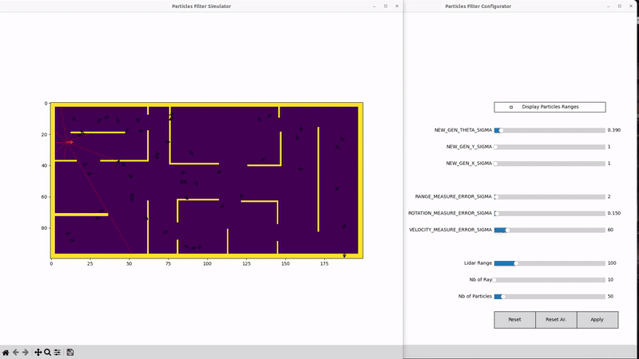
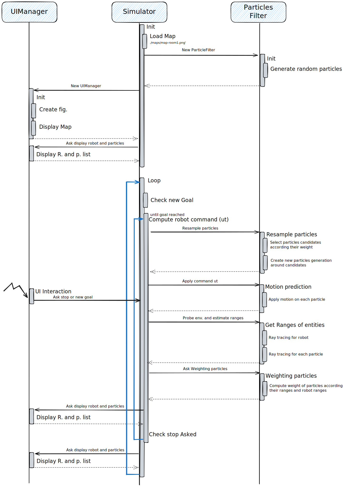
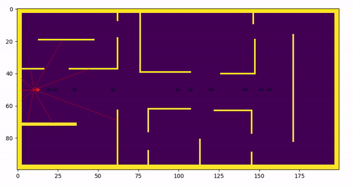
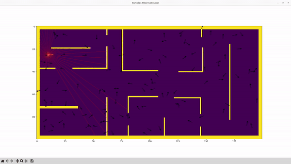

# particles_filter_simulator




## if not already installed
### Create Virtual Env 
- Clone the current repo.
    ```
        git clone https://gitlab.com/js-ros-training/particles_filter_simulator_student.git
        cd articles_filter_simulator_student
    ```
- Create a virtual env at the repository root
    ```
        python -m venv venv-p-filter
    ```
- Swtich to virtual env
    ```
        source ./venv-p-filter/bin/activate      
    ```
- Note: To go back to host env simply execute command below:
    ```
       deactivate 
    ```


### Install requirments
- Need to get the ranglibc installed to work
    ```
        git clone https://gitlab.inria.fr/socialnav/multisoc/range_libc.git
        cd range_libc
    ```

    ```
        cd pywrapper
        python3 setup.py install
    ```

- Install other requirements
    ```
        pip install -r requirements.txt
    ```

## How to Start
- Start the simulation in simple mode
    ```
        python simulator.py --simple
    ```

- Start the simulation in normal mode mode
    ```
        python simulator.py
    ```

## Simulator commands
- On the simulator left click on a point to ask the robot to move (bicycle model)
- Right Click to stop the order

## Program Behavior




## The job to do

### Simple mode
- Start the simulation in simple mode
    ```
        python simulator.py --simple
    ```
- here the simulator fixes the y of the robot

- Create first particles set, modify the `particles_filter.py` file function:

    ```python
        def getRandParticle(self,nbr: int, min_x:int , max_x:int , min_y: int , max_y: int, max_theta:float= np.pi*2):
        """ Generate random particles

        Parameters
		----------
        - nb: int: number of particles
        - min_x: int :min x value
        - min_y: int :min y value
        - max_x: int :max x value
        - max_y: int :max y value
        - max_theta: float: max theta value

        Returns:
        - particles_list: T.List[Particle]: list of new generated particles
        """
        particles_list = []

        #########################
        #      WORK  TODO       #
        #########################
        #                       #
        #                       #
        #                       #
        #                       #
        #########################
        
        # keep this for display
        w_list=np.zeros((nbr))
        w_list=w_list+1 / float(nbr)
        self.weight_list = np.asarray(w_list)
        return particles_list

    ```

- Compute particles weights, modify the `particles_filter.py` file function:
    ```python
    def weighting_particles_list(self,robot:Robot):
        """ Evaluate each particle in self.particles_list according their ranges perception
        p.ranges hold the distance to obstacles. Each range represents a distance between the current particle p to an obstacle given an angle
        p.ranges and robot.ranges are order in the same way. Meaning that p.ranges[0] and robot.ranges[0] represent the perception from the same angle

        Parameters
		----------
        - robot: Robot: Robot , ranges is used to evaluate each particle (robot.ranges)

        Results
		----------
        - Each particle weight (p.weight) belonging to self.particles_list is set
        """


        #########################
        #      WORK  TODO       #
        #########################
        #                       #
        #                       #
        #                       #
        #                       #
        #########################
        
        # keep this for display
        # p_weight_max is the maximum weight computed for all particles
        # weight_list holds weight of particle following the same order than self.particles_list
        p_weight_max =0
        weight_list=[]

        #########################
        #      WORK  TODO       #
        #########################
        #                       #
        #                       #
        #                       #
        #                       #
        #########################
        self.p_weight_max = p_weight_max
        self.weight_list = weight_list

        return weight_list, p_weight_max
    ```

    - Resample particles, 
        - modify the `particles_filter.py` file function:

            ```python
                def resample_particles(self):

                """ Create a new generation of particles based on the weight and pose of the ancestors.

                Results
	        	----------
                - self.particles_list receives the new generation of particles
                """

                new_particles_list =[]
                
                
                #########################
                #      WORK  TODO       #
                #########################
                #                       #
                #                       #
                #                       #
                #                       #
                #########################

                # Tips do not forget to use self.weight_list for new particles generation creation
                #       complete Particle, generate_new_coord_theta function and use it here like p.generate_new_coord_theta(p.x,p.y,p.theta) 

                self.particles_list = new_particles_list
            ```

        - modify `particles.py` file function:
            ```python
                def generate_new_coord_theta(self,x:int,y:int,theta:float):
                """ Generate new pose (x,y,theta) of the current particle around (exploration) the given pose
                Parameters
		        ----------
                - x: int: x base
                - y: int : y base
                - theta: float :theta base
                """
                
                #########################
                #      WORK  TODO       #
                #########################
                #                       #
                #                       #
                #                       #
                #                       #
                #########################
                # self.x , self.y ,self.theta  are set with new values

            ```

    - Apply command on particles
        - In `particles_filter.py`, the function `motion_prediction` call for each particle the method  `model_with_error`:
        - In the `particle.py` file update the following function:

        ```python
        def model_with_error(self, throttle, guidon):
            """ Apply given motion command plus error

            Parameters
	    	----------
            - throttle: flaot: Velovity
            - guidon: int :guidon ange

            """

            #########################
            #      WORK  TODO       #
            #########################
            #                       #
            #                       #
            #                       #
            #                       #
            #########################

            # current command + error
            # Modify the following two commandes
            throttle_with_error_velocity = throttle
            guidon_with_error_theta = guidon

            # keep the command below for applying the new commmand to the current particle
            self.model(throttle_with_error_velocity,guidon_with_error_theta)
        ```

### Additional work
- Influence of environement and different parameters
    - Generate several test environments (at least 5) and highlight particle filter behaviour of each of them (specify the chosen, weight computation method, motion and observation error model)
    
    - Test different weight computation method (at least 2) on these generated environments (specify the chosen motion and observation error model)
    
    - Test different motion models (at least 2) error on these generated environments (specify the chosen weight computation method and observation error model)

    - Test the influence of the observation error model on these generated environments (specify the chosen weight computation method and motion error model)

For each analysis, provide a set of screenshots and your associated comments and conclusion

### Expected behavior in simple mode
   


### Standard mode
 - Start the simulateur as follow:
 - Start the simulation in normal mode mode
    ```
        python simulator.py
    ```

 - As above update your code to take into account variation on x, y and theta
    - Update the following functions:
        - `particles_filter.py` : `getRandParticle`
        - `particles_filter.py` : `weighting_particles_list`
        - `particles_filter.py` : `resample_particles`
        - `particles.py` : `generate_new_coord_theta`
        - `particles.py` : `model_with_error`

### Expected behavior in standard mode
   


## Docker Version

### Docker Installation
- In the current directory build docker image

```
    docker build -t particles_filter_simulator_student:v1.0 .
```
- Run docker container and enable X11 redirection (here linux example)
```
    xhost +
    docker run -it --rm --name particle_simulator -e DISPLAY=$DISPLAY -v /tmp/.X11-unix:/tmp/.X11-unix particles_filter_simulator_student:v1.0 /bin/bash
```
- For Windows users see X11 with mobaXterm info here https://www.rootisgod.com/2021/Running-Linux-Desktop-Apps-From-a-Docker-Container-on-Windows-with-MobaXterm/ 


### Use Pre-build Docker version

- Run docker container and enable X11 redirection (here linux example)
```
    xhost +
    docker run -it --name particle_simulator -e DISPLAY=$DISPLAY -v /tmp/.X11-unix:/tmp/.X11-unix registry.gitlab.com/js-ros-training/particles_filter_simulator_student:v1.0 /bin/bash
```
- For Windows users see X11 with mobaXterm info here https://www.rootisgod.com/2021/Running-Linux-Desktop-Apps-From-a-Docker-Container-on-Windows-with-MobaXterm/ 


### Interacting with container

#### Visual studio code

- Install the Dev Containers extension
- Go to the Dev Containers extension tab
- On "Remote Explorer" window, select your container and click on "Attach on current window"
- Visual Studio Code is now connected to the targeted Container
- Select the "Explorer" view click to Open Folder
- Choose the following path `/app/particles_filter_simulator_student/`